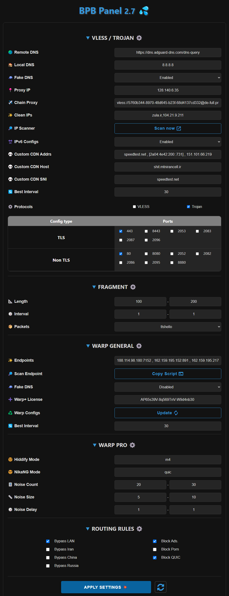

<h1 align="center">💦 BPB Panel</h1>

### 🌏 Readme in [Farsi](README_fa.md)

  

 

## Introduction
This project is dedicated to developing a user panel for the [Cloudflare-workers/pages proxy script](https://github.com/yonggekkk/Cloudflare-workers-pages-vless) created by [yonggekkk](https://github.com/yonggekkk). The panel offers two deployment options: 
- **Worker** deployment
- **Pages** deployment
 
